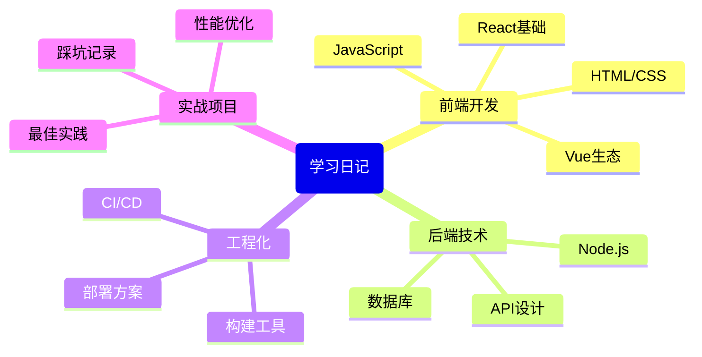
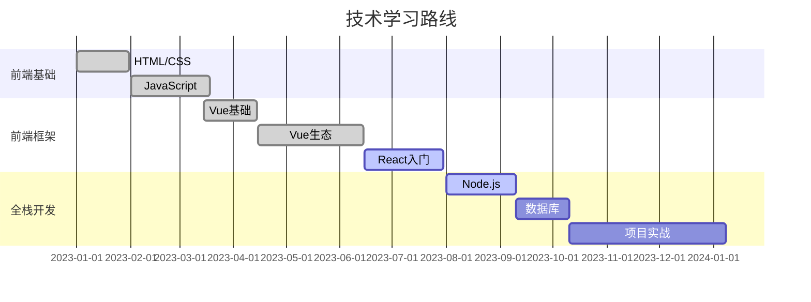

# 学习日记简介

## 什么是学习日记？

学习日记是我在前端开发和全栈开发过程中的知识积累、思考和实践记录。这里包含了从基础到进阶的各种技术笔记、实践经验和解决方案，旨在帮助自己系统化地梳理知识，也希望能对其他开发者有所帮助。

::: tip 学习日记的意义
学习日记不仅是知识的记录，更是成长的见证。通过定期回顾和更新，可以发现自己的进步和不足，明确未来的学习方向。
:::

## 日记内容概览

## 快速导航

### 前端学习专区

- [Vue面试题总结](/pages/learning-diary/front-end/vue-interview-questions) - 系统整理的Vue常见面试题和答案
- [Vue3项目构建](/pages/learning-diary/front-end/vue3-project-construction) - Vue3项目从零开始的构建过程记录

<!-- 
以下页面暂未创建，先注释掉以避免死链接
- [CSS布局技巧](/pages/learning-diary/front-end/css-layout-techniques) - 现代CSS布局方案和响应式设计
- [JavaScript进阶](/pages/learning-diary/front-end/javascript-advanced) - JavaScript高级特性和最佳实践
-->

### 即将更新的内容

未来我将陆续添加以下内容：

- CSS布局技巧 - 现代CSS布局方案和响应式设计
- JavaScript进阶 - JavaScript高级特性和最佳实践
- Node.js基础 - Node.js核心概念和应用
- 数据库设计 - 关系型和非关系型数据库的设计原则
- API开发指南 - RESTful API和GraphQL的设计与实现
- Webpack配置指南 - Webpack的基础配置到高级优化
- Vite实践 - Vite的使用技巧和性能优化
- Docker部署 - 使用Docker容器化前端应用

## 最近学习记录

::: details 2024年3月学习进度
- ✅ VitePress博客搭建与定制化
- ✅ Vue3组合式API深入理解与实践
- ✅ TypeScript类型体操进阶
- 🔄 服务端渲染(SSR)实现原理
- 📅 微前端架构设计与实践
:::

## 学习方法分享

学习编程技术并非一蹴而就，我总结了一些有效的学习方法：

1. **项目驱动学习**: 通过实际项目来应用新知识，加深理解
2. **知识图谱构建**: 将零散知识点连接成体系，形成自己的知识网络
3. **定期复盘总结**: 每周/每月对学习内容进行回顾和整理
4. **实践-反思循环**: 实践中发现问题，解决问题后总结经验

::: warning 学习陷阱
避免陷入"无限学习"的循环，学习新技术时要有明确目标，并尽快付诸实践。
:::

## 技术成长路线

## 参与贡献

如果你有好的学习资源或经验想要分享，欢迎通过以下方式参与贡献：

- 提交Pull Request添加新的学习笔记
- 在评论区分享你的学习心得
- 指出文章中的错误或需要改进的地方

让我们一起在编程的道路上不断进步！

::: tip 每日一句
"学习编程最好的时机是十年前，其次是现在。持续学习，才能在技术快速迭代的今天保持竞争力。"
:::