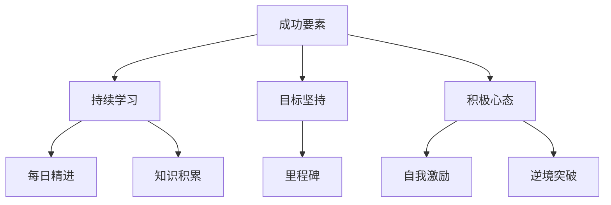
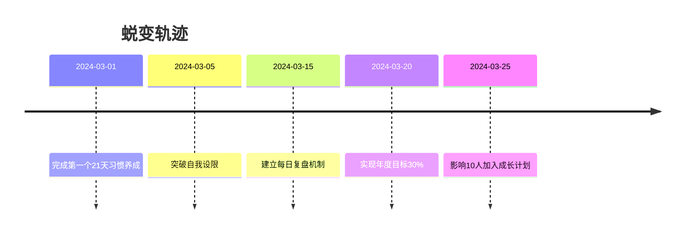

# 每日成长之路

## 心灵成长图谱

## 励志能量站

### 每日箴言
- "坚持是成功的通行证" 
- "每天进步1%，一年强大37倍"
- 「困难是成长的垫脚石」
- 『你的潜力超乎想象』

### 成功案例
- 从零到精通的100天挑战
- 坚持早起365天记录
- 逆境反转的真实故事
- 突破极限的成长轨迹

## 成长时间轴

## 能量补给站

::: card
**今日能量**  
你比自己想象的更强大！
:::

::: card
**成功法则**  
坚持 × 时间 = 奇迹
:::

::: card
**成长公式**  
每天进步1% >> 100%停滞
:::

::: card
**强者思维**  
问题=机会 困难=台阶
:::

