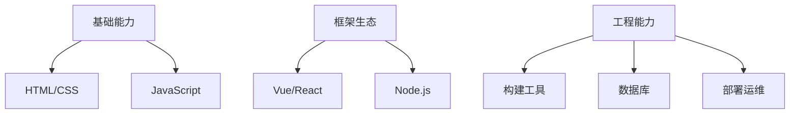
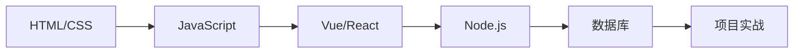

# 全栈能力成长矩阵

## 知识体系三维度


## 前端技术栈

### 现代CSS实践
::: tip 响应式布局方案
```css
/* Tailwind CSS容器示例 */
@layer components {
  .responsive-grid {
    @apply grid grid-cols-1 md:grid-cols-2 lg:grid-cols-3 gap-4;
  }
}

/* CSS Grid高级布局 */
.article-layout {
  display: grid;
  grid-template-areas: 
    "header header"
    "sidebar main"
    "footer footer";
  grid-template-columns: 240px 1fr;
}
```
:::
::: details 现代布局技巧
```css
.container {
  display: grid;
  grid-template-columns: repeat(auto-fit, minmax(300px, 1fr));
  gap: 1rem;
}
```
:::

### 类型安全实践
::: details TypeScript类型体操
```typescript
// Vue3组合式API类型增强
type User = {
  id: number;
  name: string;
  email: `${string}@${string}.${string}`;
};

export const useUserStore = defineStore('user', () => {
  const users = ref<User[]>([]);
  
  const fetchUsers = async () => {
    const response = await fetch('/api/users');
    users.value = await response.json();
  };

  return { users, fetchUsers };
});
```
:::

```js
// Vue3组合式API示例
import { ref, onMounted } from 'vue'

export default {
  setup() {
    const count = ref(0)
    
    onMounted(() => {
      console.log('Component mounted')
    })

    return { count }
  }
}
```

## 构建工具链

| 特性       | Webpack          | Vite           |
|------------|------------------|----------------|
| 构建速度   | 中等             | 极快           |
| HMR        | 支持             | 原生ESM        |
| 配置复杂度 | 高               | 低             |

## 全栈工程实践
### 数据库连接方案
```typescript
// Prisma + MySQL配置示例
const prisma = new PrismaClient({
  datasources: {
    db: {
      url: process.env.DATABASE_URL,
    },
  },
});

// TypeORM实体定义
@Entity()
export class User {
  @PrimaryGeneratedColumn()
  id: number;

  @Column({ length: 50 })
  name: string;
}
```

```bash
# Express服务器示例
npm install express
```

```javascript
// Node.js REST API
app.get('/api/users', (req, res) => {
  db.query('SELECT * FROM users')
    .then(result => res.json(result))
    .catch(err => res.status(500).send(err))
})
```

## 学习时间轴

- [x] 2024-03-01 完成VitePress基础配置
- [x] 2024-03-05 掌握Vue3组合式API
- [x] 2024-03-15 掌握Prisma ORM基础
- [ ] 2024-03-20 实现JWT鉴权方案
- [ ] 2024-03-25 完成全栈项目部署

## 常见问题解决方案

::: warning 跨域问题
推荐使用Vite代理配置：
```js
// vitepress.config.js
export default {
  server: {
    proxy: {
      '/api': 'http://localhost:3000'
    }
  }
}
```
:::

## 技术路线图

